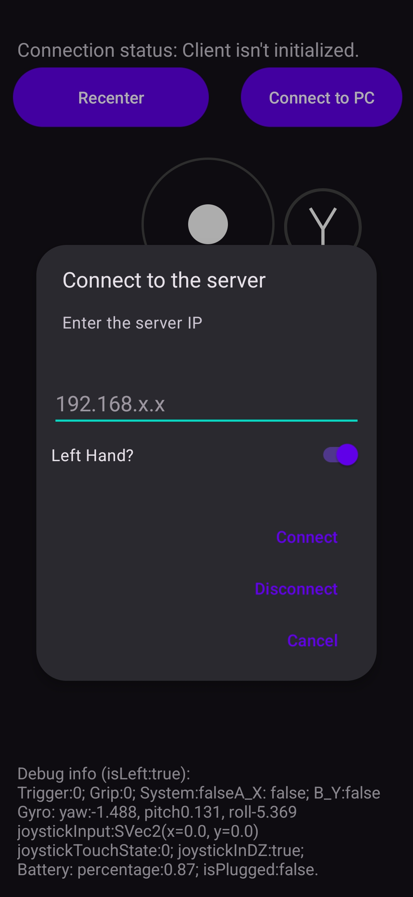
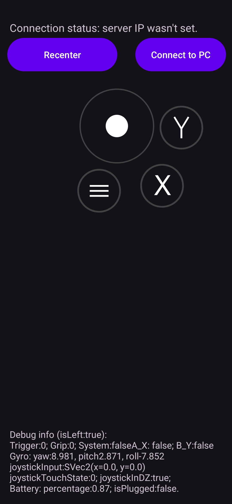
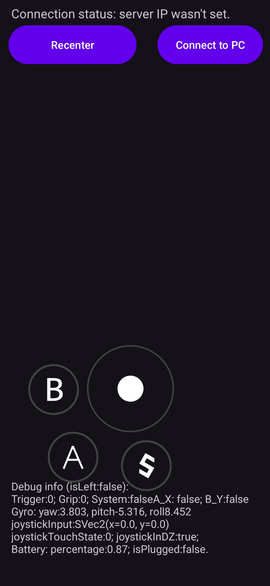

# S2UK SteamVR Controller


Proof-of-concept 6-DOF SteamVR controller implementation using Kinect, NuiApi for positional tracking with phone-based controller input.

---

## Table of Contents

- [About](#about)
- [How it works](#how-it-works)
- [Features](#features)
- [Tech Stack](#tech-stack)
- [Prerequisites](#prerequisites)
- [Installation](#installation)
- [Build & Run](#build--run)
- [Post-Build](#post-build)
- [Troubleshooting](#troubleshooting)
- [Configuration](#configuration)
- [Controller Layout](#controller-layout)
- [Screenshots & Videos](#screenshots--videos)
- [Contributing](#contributing)
- [Roadmap](#roadmap)
- [Credits](#credits)
- [License](#license)
- [Contact](#contact)

---

## About

S2UK SteamVR Controller is a proof-of-concept 6-DOF SteamVR system that turns Android phones into fully tracked VR controllers.

It was made using Kinect v1 (Xbox 360) hardware with Microsoft's NuiApi for head/hand positional tracking.

**Note:** Positional tracking is limited to approximately 180° in front of the sensor.

The Android app **emulates** Meta Touch Plus controllers (from Meta Quest 3/3S), providing a low-cost alternative for users who want to experiment with VR or quickly test applications without a full VR setup.


**Project architecture:**
- **Windows SteamVR driver** – Fully-written in C++ - communicates with the connected Android device via TCP and interfaces with the Kinect sensor and OpenVR.
- **Android companion app** – Built with Java/Kotlin/C++ - sends orientation and input data to the PC and receives haptic feedback over the local network.

---

## How it works

### Driver Hooks
The SteamVR driver hooks into these interfaces:

- `IVRServerDriverHost005::TrackedDevicePoseUpdated`
- `IVRServerDriverHost006::TrackedDevicePoseUpdated`
- `IVRDriverContext::GetGenericInterface`

Then it feeds head position data retrieved from the Kinect sensor into `IVRServerDriverHost005` and `IVRServerDriverHost006`.

*Controllers also receive positional data from the Kinect (doesn't get sent to phone app), but ***without hooking***, since the driver owns their device IDs.*

### Network Communication
- The SteamVR driver hosts a TCP server on port `9775`.
- Android clients connect and send controller data every **10 ms**.
- Once SteamVR pulls a haptic event → gets broadcasted to the clients → decoded → intepreted.

---


## Features

- **6-DOF Tracking**
- **Phone-Based Controllers** 
- **Tracking EMA Filter**
- **Sensor Tilt Adjustment**
- **Haptic Feedback**
- **Automatic Config Generation**
- **Low-cost Setup**

---

## Tech Stack

- **Languages:** C++20, Java, Kotlin
- **Libraries:** OpenVR, NuiApi, MinHook
- **Build Tools:** MSVC, Gradle, CMake
- **Hardware:** SteamVR-compatible HMD (or emulated), Kinect v1 (Xbox 360 Kinect), Android phones

---

## Prerequisites

- **Cpp-compatible compiler:**
  - MSVC 17.x (Visual Studio 2022)
- **Android Studio** (latest stable)
- **CMake** ≥ 3.22.1 
- **Android NDK** (can be installed via Android Studio SDK Manager)
- **Gradle**
- **Kinect for Windows SDK v1.8** - [Link](https://www.microsoft.com/en-us/download/details.aspx?id=40278)
- **Minimum supported Android API version:** `31` (Android 12)

---

## Installation

1. **Install SteamVR**
   - [SteamVR Store Page](https://store.steampowered.com/app/250820/SteamVR/)
2. **Install Kinect SDK v1.8**
   - [Kinect for Windows SDK v1.8](https://www.microsoft.com/en-us/download/details.aspx?id=40278)
3. **Get the latest release**
   - Download the **SteamVR driver** and **Android APK** from the [Releases](https://github.com/s2ukDev/SteamVRController/releases) tab.
   - Or compile both from source.
4. **Install the SteamVR driver**
   - Unzip the driver into:
     ```
     <Steam installation directory>\steamapps\common\SteamVR\drivers\
     ```

---

## Build & Run

1. **Clone the repo**

```bat
git clone https://github.com/s2ukDev/SteamVRController.git
```

2. **Build the Windows SteamVR driver**
   1. Open the solution in Visual Studio 2022:
     * SteamVRController\SteamVR-Windows-Driver\s2uk_controller\s2uk_controller.sln
   2. Modify the post-build script if necessary:
     * SteamVRController\SteamVR-Windows-Driver\s2uk_controller\postBuildScript.bat
   3. **Build the project in Release mode.**
3. **Build the Android app**
   1. Open Android Studio.
   2. Make sure the Android NDK is installed.
   3. Make sure your phone API version is supported (minSdk = 31 / Android 12).
   4. Open the project located at: SteamVRController\Android\S2UK_VRController
   5. Build the APK in Android Studio UI or via terminal:
      ```bat
      gradlew assembleRelease
      ```
   6. Install the APK on your Android devices.

## Post-build

  1. The post-build script will copy the driver for you automatically.  
   - Confirm the driver exists at:
     
     `<Steam installation directory>\steamapps\common\SteamVR\drivers\s2ukController\`
     
   - If not, modify `<repositoryDir>\SteamVRController\SteamVR-Windows-Driver\s2uk_controller\postBuildScript.bat` to point to your Steam installation directory and re-run the build.
  2. Connect your Kinect v1 sensor and verify the Kinect SDK v1.8 is working properly.
  3. Start **SteamVR**.
  4. In SteamVR go to **Settings → Drivers** and enable **s2ukController** (toggle the driver on).
  5. Launch the Android app on your phones and enter the Steam VR PC's local IP address.  
   - **Controllers should start receiving orientation updates and positional data from the Kinect.**

---

## Troubleshooting

- Restart SteamVR and verify the driver folder exists:  
  `<Steam installation directory>\steamapps\common\SteamVR\drivers\s2ukController\`
- Check the post-build script for errors, copy the driver manually.
- Use Android Studio **Logcat** / `adb logcat` to debug the app → PC connection for errors.
- Ensure the PC and phone are on the **same local network** and same subnet.
- Check for firewall settings and open/forward the required LAN port (`TCP 9775`).
- If problems persist, reboot the PC and the phone and try again.

**If none of the above help, submit a github issue describing your problem.**

---

## Configuration

Driver configuration is stored as JSON at:

`<Steam installation directory>\steamapps\common\SteamVR\drivers\s2ukController\driver_config.json`

**Note:**  
- The configuration file will be **automatically generated** if it does not exist or contains corrupted syntax.  
- Changes to the config are applied when the headset **exits standby** or during **SteamVR driver initialization**.

### Example `driver_config.json`
```json
{
  "headEMA": 0.3,
  "leftHandEMA": 0.3,
  "rightHandEMA": 0.3,
  "sensorTilt": 0
}
```
**Fields and Types**

- **headEMA** — *double* (0.0 -- 1.0)  
  Exponential moving average weight for head positional smoothing.  
  Lower = smoother (more interpolation), higher = more responsive.  
  **Default:** `0.3`

- **leftHandEMA** — *double* (0.0 -- 1.0)  
  EMA weight for left controller smoothing.  
  **Default:** `0.3`

- **rightHandEMA** — *double* (0.0 -- 1.0)  
  EMA weight for right controller smoothing.  
  **Default:** `0.3`

- **sensorTilt** — *integer* (degrees, clamped to -27 -- +27)  
  Tilt angle applied to Kinect sensor. 
  **Default:** `0`

---

## Controller Layout

### Connection Settings
<p align="center">
  
</p>

---

### Left Controller
<p align="center">
  
</p>

**Hold phone in portrait mode**
- **Volume Up** → Trigger
- **Volume Down** → Grip
- **Double press** trigger / grip → Half-pressed state

---

### Right Controller
<p align="center">
  
</p>

**Hold phone in portrait mode, upside-down**
- **Volume Down** → Trigger
- **Volume Up** → Grip
- **Double press** trigger / grip → Half-pressed state

---

## Screenshots & Videos
*Screenshots and demo videos will be added to show controller & HMD tracking in SteamVR Home, Beat Saber, The Lab and VRChat.*  

---

# Contributing

When contributing to this repository, please first discuss the change you wish to make via issue,
email, or any other method with the owners of this repository before making a change. 

*Please note we have a code of conduct, please follow it in all your interactions with the project.*

## Pull Request Process

1. Ensure any install or build dependencies are removed before the end of the layer when doing a 
   build.
2. Update the README.md with details of changes to the interface, this includes new environment 
   variables, exposed ports, useful file locations and container parameters.
3. Increase the version numbers in any examples files and the README.md to the new version that this
   Pull Request would represent. The versioning scheme we use is [SemVer](http://semver.org/).
4. You may merge the Pull Request in once you have the sign-off of two other developers, or if you 
   do not have permission to do that, you may request the second reviewer to merge it for you.

---

## Roadmap

- [x] v1.0.0-alpha - Initial pre-release
- [ ] v1.0.1-alpha - Player position offset fixes
- [ ] v1.1.0-alpha - Full-body tracking
- [ ] v1.1.2-beta - Imgui Debug Window

---

## Credits

- **Maintainer:** [github.com/s2ukDev](https://github.com/s2ukDev)
<!-- - Contributors: -->
- **Controller Icons & Models:**
  Controllers in SteamVR appear as Meta Touch Plus.
  The original controller models/icons are bundled with SteamVR and are © Meta (Facebook Technologies, LLC).
  **This repository does not redistribute them.**

- **Third-Party Libraries:**
  - [MinHook](https://github.com/TsudaKageyu/minhook) – x86/x64 Function Hooking Library for Windows.
  - [OpenVR](https://github.com/ValveSoftware/openvr) – SteamVR runtime API.
  - [nlohmann/json](https://github.com/nlohmann/json) – JSON parsing library for C++.

---

## License

This project is licensed under the **MIT License**.

### Summary
- You are free to **use, copy, modify, merge, publish, distribute, sublicense, and/or sell copies** of this software.
- You must **include the original copyright and license notice** in all copies or substantial portions of the software.
- The software is provided "**as-is**", without any warranty of any kind, express or implied, including but not limited to the warranties of merchantability, fitness for a particular purpose, and non-infringement.

For the full license text, see the [LICENSE](LICENSE) file in this repository.

---

## Contact

- Email: [s2ukdev@gmail.com](mailto:s2ukdev@gmail.com)
- GitHub: [https://github.com/s2ukDev](https://github.com/s2ukDev)

---
